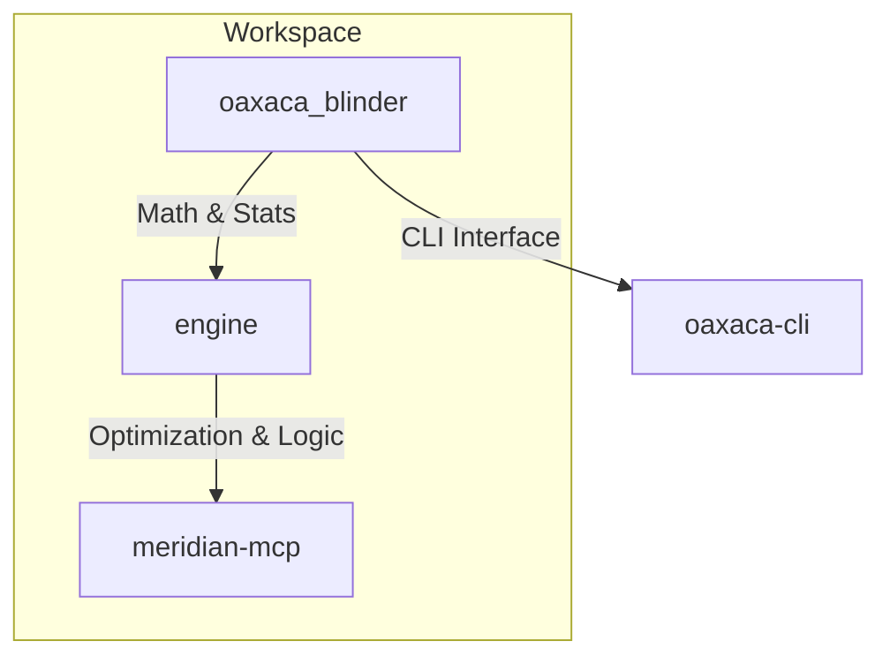

# System Architecture

This document describes the high-level architecture and design patterns of the `oaxaca-blinder-rs` workspace.

## 🏗 Workspace Structure

The project is organized as a Rust workspace with three primary members:

### 1. `oaxaca_blinder` (Core Math)
Contains the mathematical implementations of econometric models.
- **`math/`**: Foundational OLS, WLS, Normalization, and RIF logic.
- **`decomposition.rs`**: Implementation of Two-fold and Three-fold Oaxaca-Blinder logic.
- **`akm.rs`**: Labor market fixed-effects model (Abowd-Kramarz-Margolis).
- **`matching/`**: Causal inference matching algorithms (Nearest Neighbor, PSM).

### 2. `engine` (Audit/Optimization Engine)
A higher-level service layer that sits on top of the math library.
- **`analysis.rs`**: Orchestrates decomposition and performs budget allocation optimization.
- **`defensibility.rs`**: Audits proposed adjustments for statistical parity and legal defensibility.

### 3. `meridian-mcp` (Interface)
An implementation of the [Model Context Protocol](https://modelcontextprotocol.io).
- Provides a bridge between LLMs (like Claude) and the econometric engine.
- Supports both Stdio and SSE (Server-Sent Events) transports.

## 📐 Design Patterns

### Builder Pattern
Used extensively for configuring complex statistical models.
- Example: `OaxacaBuilder` allows incremental configuration of predictors, weights, and bootstrap parameters before execution.

### Strategy Pattern (Planned)
The allocation engine uses different strategies (Greedy, Equitable) to distribute budgets, allowing users to swap remediation goals easily.

## 🔄 Data Flow

1. **Input**: Raw CSV data or DataFrames are loaded via Polars.
2. **Setup**: The `Builder` prepares matrices $X$ (predictors) and $Y$ (outcome).
3. **Estimation**: The `ols` module calculates $\beta$ coefficients using Cholesky decomposition for stability.
4. **Decomposition**: Differences in $Y$ are decomposed into "Explained" and "Unexplained" components.
5. **Output**: Results are returned as structured JSON or Comfy-Table reports.
